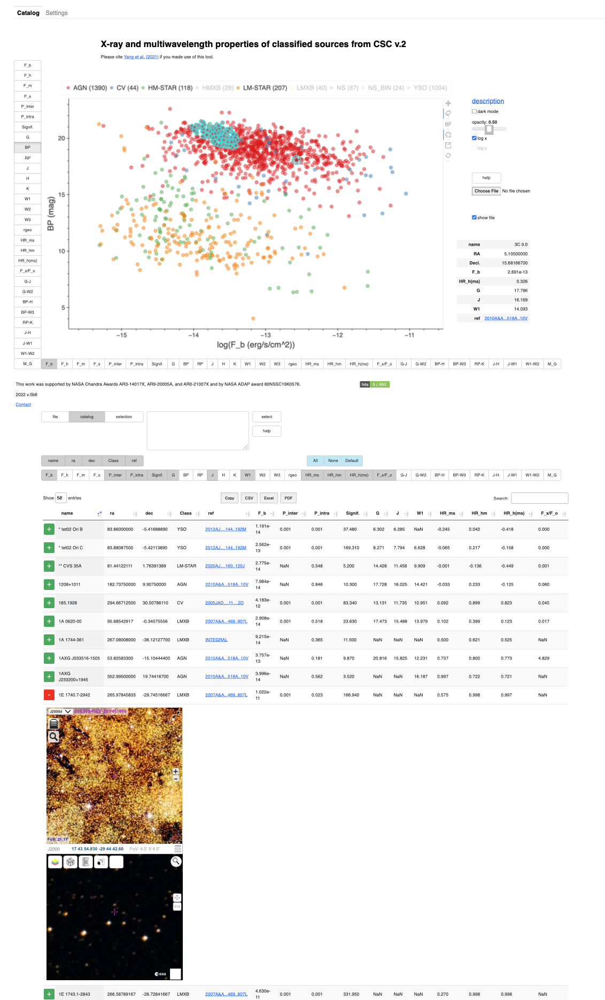
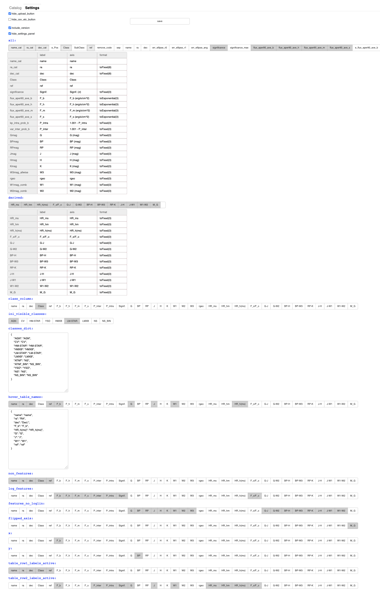

<details><summary>Settings panel screenshot</summary>
    
    

</details>

# About


This tool allows for easy interactive visualization of a `csv` file with multidimensional numerical data.

When applicable, one can specify a feature as a class feature so that the the objects belonging to each class will have a unique color, could be shown/hidden etc.

The user can choose from multiple features by clicking the corresponding buttons to the left of the Y-axis and below the X-axis. At the top there are buttons corresponding to the distinct classes. Users can choose to display different combinations of the classes by toggling/untoggling the class names. Whenever appropriate, a logarithmic scale is used in the plot (which is reflected in the axis labels). The user can select a source by clicking on it and some information about the source will be shown. A lasso tool can be used to select a group of sources which then remain selected for any combination of features plotted. The plot can be easily saved as a PNG file by clicking the corresponding button to the right of the plot.


CIDview has benn used to visualize data for several astronomical datasets:

* [XCLASS](https://home.gwu.edu/~kargaltsev/XCLASS/)  -- visualizes the content of the multiwavelength training dataset ([Yang et al. 2021](https://iopscience.iop.org/article/10.3847/2515-5172/abfcd4/meta)) based on Chandra Source Catalog.

* [XDBS](https://home.gwu.edu/~kargaltsev/XDBS/)  -- visualizes the content of the X-ray detected Be star catalog ([Gobat et al. 2022](https://iopscience.iop.org/article/10.3847/2515-5172/ac8937/meta)).
    
* [XCLASS\_XMM](https://home.gwu.edu/~kargaltsev/XCLASS_XMM/)  -- visualizes the content of the multiwavelength training dataset (Yang et al., in preparation) based on 4XMM X-ray source catalog.
    
* [GCLASS](https://home.gwu.edu/~kargaltsev/GCLASS/) -- visualizes the content of the 4FGL-DR4 Fermi Gamma-rag Observatory LAT catalog.
              

# Installation

1. Clone this repo and

```
cd CIDview
```

2. [optional] Create environment

```
mamba create -n CIDview
mamba activate CIDview
```

2. Install dependencies

```
mamba env update --file environment.yml
```

3. Test installation:

```
python code/CIDview.py data/gll_pcs_v28.csv settings/gll_pcs_v28_settings.json
```

The code will generate `index.html` in `html` folder.

# Usage

```
python code/CIDview.py <csv_file> [settings_file.json]
```

The `Settings` panel (top left corner) allows the user to customize most of the GUI. The settings can be saved and then used to recreate the html file. 


